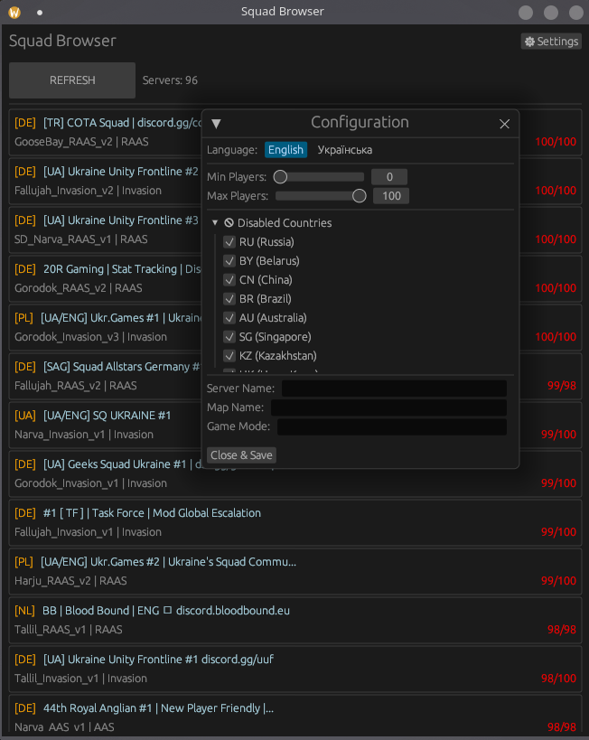

# 🇺🇦 Squad Server Browser (Rust Edition)

A high-performance, native desktop server browser for the game **Squad**.  
Built completely in **Rust** using `egui`.



## ⚡ Features

- **Native Performance**: Written in pure Rust. Fast startup, low RAM usage.
- **No Dependencies**: Single `.exe` file. No Steam required running in the background.
- **Smart Filtering**:
  - Filter by player count (Min/Max).
  - **Blacklist System**: Hide servers from specific countries (RU, CN, BR, etc.).
  - Search by Map or Game Mode.fgg
- **Localization**: English 🇬🇧 and Ukrainian 🇺🇦 support.

## 🛠 Installation

### For Users (Windows)
1. Go to the [Releases](../../releases) page.
2. Download `squad_browser.exe`.
3. Run it. That's it!

### For Developers (Build from source)
You need **Rust** installed.

```bash
# Clone the repository
git clone https://github.com/69-Lukash/squad-browser.git
cd squad-browser

# Run in debug mode
cargo run

# Build release binary (optimized)
cargo build --release
